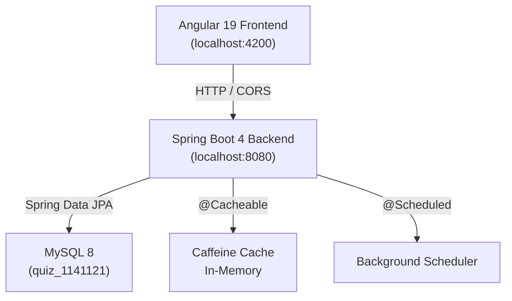

# 📋 Dynamic Questionnaire — Backend API

> 一個基於 **Spring Boot 4** 構建的動態問卷系統後端，提供完整的 RESTful API，涵蓋問卷管理、使用者系統、作答記錄與統計查詢，並與 Angular 19 前端整合部署。

<div align="center">

[](https://spring.io/projects/spring-boot)
[](https://openjdk.org/projects/jdk/17/)
[](https://spring.io/projects/spring-security)
[](https://spring.io/projects/spring-data-jpa)
[](https://www.mysql.com/)
[](https://gradle.org/)

</div>

---

## 📌 專案簡介

本專案是「動態問卷系統」的後端 API 服務，以 **Spring Boot 4 + Spring Data JPA + MySQL** 為核心技術棧。提供問卷的完整 CRUD、使用者註冊登入（BCrypt 密碼加密）、作答記錄儲存與查詢等 RESTful API，並搭配整合 **Springdoc OpenAPI（Swagger UI）** 進行線上 API 文件管理。

**本專案旨在展示以下後端開發能力：**
- ✅ **三層式架構（Controller / Service / DAO）** — 職責分離，高內聚低耦合
- ✅ **Spring Data JPA + 原生 JPQL** — 靈活的資料庫查詢策略
- ✅ **Spring Security（BCrypt）** — 密碼加密儲存，安全防護
- ✅ **全域例外處理（@RestControllerAdvice）** — 統一的錯誤回應格式
- ✅ **Caffeine Cache** — 本地快取機制，提升高頻查詢效能
- ✅ **@Scheduled 排程任務** — Spring 內建排程，定時執行背景工作
- ✅ **@Transactional 事務管理** — 確保跨 DAO 操作的資料一致性
- ✅ **Bean Validation（@Valid）** — Controller 層 Request 參數自動驗證

---

## ✨ API 功能列表

### 📝 問卷管理（Quiz）

| Method | Endpoint | 功能說明 |
|--------|----------|---------|
| `POST` | `/quiz/create` | 建立新問卷（含問題列表） |
| `GET` | `/quiz/getAll` | 取得所有問卷列表 |
| `GET` | `/quiz/get?quizId={id}` | 取得單筆問卷（含題目詳情） |
| `GET` | `/quiz/get_QuestionList?quizId={id}` | 取得指定問卷的所有題目 |
| `POST` | `/quiz/update` | 更新問卷（含智慧差異更新題目） |
| `POST` | `/quiz/delete` | 批次刪除問卷 |

### 📨 作答記錄（Fillin）

| Method | Endpoint | 功能說明 |
|--------|----------|---------|
| `POST` | `/quiz/fillin` | 提交問卷作答（自動建立訪客帳號） |
| `GET` | `/quiz/feedback?quizId={id}` | 取得指定問卷所有作答者回覆清單 |
| `POST` | `/quiz/feedback` | 取得指定使用者對特定問卷的詳細作答 |

### 👤 使用者系統（User）

| Method | Endpoint | 功能說明 |
|--------|----------|---------|
| `POST` | `/user/register` | 會員註冊（密碼 BCrypt 加密） |
| `POST` | `/user/login` | 會員登入（比對加密密碼，回傳用戶資料） |
| `POST` | `/user/check_registered` | 檢查 Email 是否為已註冊會員 |
| `POST` | `/user/update` | 更新會員資料（支援選填新密碼） |

---

## 🏗️ 專案架構

```
src/main/java/com/example/quiz_1141121/
├── Quiz1141121Application.java     # Spring Boot 啟動入口（排除預設 Security 配置）
│
├── config/
│   └── CaffeineCacheConfig.java    # Caffeine 本地快取配置（TTL 600s, Max 500筆）
│
├── constants/
│   ├── ReplyMessage.java           # 統一 API 回應代碼與訊息 Enum
│   ├── Type.java                   # 題型定義 Enum（SINGLE / MULTI / TEXT）
│   └── ValidationMsg.java          # Bean Validation 錯誤訊息常數
│
├── controller/
│   ├── QuizController.java         # 問卷與作答 REST 端點
│   ├── FillinController.java       # 作答查詢 REST 端點
│   └── UserController.java         # 使用者系統 REST 端點
│
├── service/
│   ├── QuizService.java            # 問卷核心業務邏輯（含排程、事務管理）
│   ├── FillinService.java          # 作答記錄儲存與查詢邏輯
│   ├── UserService.java            # 使用者認證與資料更新邏輯
│   └── QuestionService.java        # 問題服務（輔助）
│
├── dao/
│   ├── QuizDao.java                # 問卷資料存取（Spring Data JPA）
│   ├── QuestionDao.java            # 問題資料存取（含 JPQL 批次操作）
│   ├── FillinDao.java              # 作答記錄存取
│   └── UserDao.java                # 使用者資料存取
│
├── entity/
│   ├── Quiz.java                   # 問卷實體（對應 quiz 資料表）
│   ├── Question.java               # 問題實體（複合主鍵）
│   ├── QuestionId.java             # Question 複合主鍵類別
│   ├── Fillin.java                 # 作答記錄實體（複合主鍵）
│   ├── FillinId.java               # Fillin 複合主鍵類別
│   └── User.java                   # 使用者實體
│
├── req/
│   ├── CreateReq.java              # 建立問卷請求體
│   ├── UpdateReq.java              # 更新問卷請求體（繼承 CreateReq）
│   ├── DeleteReq.java              # 批次刪除請求體
│   ├── FillinReq.java              # 作答提交請求體
│   ├── FeedbackReq.java            # 查詢作答請求體
│   ├── LoginReq.java               # 登入請求體
│   └── RegisterReq.java            # 註冊請求體
│
├── res/
│   ├── BasicRes.java               # 基礎回應（code + message）
│   ├── CreateRes.java              # 建立問卷回應
│   ├── GetQuizRes.java             # 問卷列表回應
│   ├── GetSingleQuizRes.java       # 單筆問卷回應
│   ├── GetQuestionRes.java         # 題目列表回應
│   ├── UpdateRes.java              # 更新問卷回應
│   ├── LoginRes.java               # 登入回應（含使用者資料）
│   ├── FeedbackRes.java            # 單人作答詳情回應
│   ├── FeedbackUserVo.java         # 作答使用者 VO
│   └── GetFeedbackUserRes.java     # 所有作答者回應
│
├── vo/
│   └── AnswerVo.java               # 問題與答案組合的 Value Object
│
└── exception/
    └── GlobalExceptionHandler.java # 全域例外處理（@RestControllerAdvice）
```

---

## 🔧 技術棧

| 類別 | 技術 | 版本 |
|------|------|------|
| 後端框架 | Spring Boot | 4.0.2 |
| 程式語言 | Java | 17 |
| ORM / 資料存取 | Spring Data JPA | 4.x |
| 資料庫 | MySQL | 8.x |
| 安全性 | Spring Security + BCrypt | 6.x |
| 快取 | Caffeine Cache | 3.x |
| API 文件 | Springdoc OpenAPI (Swagger UI) | 3.0.2 |
| 參數驗證 | Spring Validation（Bean Validation） | 內建 |
| 建置工具 | Gradle | 8.x |
| 熱重載 | Spring DevTools | 內建 |
| 日誌管理 | SLF4J + Logback | 內建 |

---

## 🚀 技術亮點

### 1. 智慧差異更新問題列表（Diff Update Strategy）

更新問卷時，**不直接刪除所有題目再重建**（避免 Fillin 作答記錄的外鍵關聯遺失），而是透過 Stream API 比對新舊題目 ID，精準執行「保留更新 / 新增 / 刪除」三種操作：

```java
// QuizService.java — update()
List<Integer> oldIds = oldQuestions.stream()
    .map(Question::getQuestionId).toList();

List<Integer> newIds = req.getQuestionList().stream()
    .map(Question::getQuestionId)
    .filter(id -> id > 0).toList();

// 找出需要刪除的 ID (在舊的中，但不在新的中)
List<Integer> idsToDelete = oldIds.stream()
    .filter(id -> !newIds.contains(id)).toList();

if (!idsToDelete.isEmpty()) {
    questionDao.deleteByIds(req.getQuizId(), idsToDelete);
}
```

### 2. 全域例外處理（@RestControllerAdvice）

使用 `@RestControllerAdvice` 集中攔截全部例外，確保所有 API 回應格式統一，前端不會收到意外的 HTML 錯誤頁面：

```java
// GlobalExceptionHandler.java
@ExceptionHandler({MethodArgumentNotValidException.class})
public ResponseEntity<Map<String, Object>> paramExceptionHandler(MethodArgumentNotValidException e) {
    // @Valid 驗證失敗 → 統一回傳 HTTP 400 + 第一個錯誤訊息
    Map<String, Object> errorMap = new HashMap<>();
    errorMap.put("code", HttpStatus.BAD_REQUEST.value());
    errorMap.put("message", e.getAllErrors().get(0).getDefaultMessage());
    return ResponseEntity.badRequest().body(errorMap);
}
```

### 3. 訪客與會員共存的使用者系統

作答時自動區分「訪客」與「已註冊會員」，透過密碼是否存在來判斷身份，且**不覆蓋已註冊會員的個人資料**：

```java
// FillinService.java — fillin()
User currentUser = userDao.getByEmail(req.getEmail());
boolean isRegisteredUser = StringUtils.hasText(currentUser.getPassword());

// 只有訪客才允許更新資料，保護已註冊會員的帳號安全
if (!isRegisteredUser) {
    userDao.update(req.getName(), req.getPhone(), req.getAge(), req.getEmail());
}
```

### 4. 防重複提交保護

作答前先確認是否已填寫過，防止 Primary Key 衝突造成 500 錯誤：

```java
// FillinService.java
if (fillinDao.existsByQuizIdAndUserEmail(req.getQuizId(), req.getEmail())) {
    return new BasicRes(400, "您已填寫過此問卷，請勿重複提交！");
}
```

### 5. BCrypt 密碼加密

所有密碼均透過 **BCrypt** 雜湊儲存，登入時使用 `matches()` 比對，原始密碼**永不存入資料庫**：

```java
// UserService.java
userDao.insert(req.getEmail(), req.getName(),
    encoder.encode(req.getPassword()), ...);  // 加密後儲存

// 登入比對
if (!encoder.matches(req.getPassword(), user.getPassword())) {
    return new LoginRes(400, "密碼錯誤");
}
// 登入成功：清除密碼欄位再回傳，避免敏感資料外洩
user.setPassword(null);
```

### 6. Caffeine 本地快取

配置 Caffeine 快取管理器，對高頻查詢（如問題列表）提供記憶體快取，設定最大 500 筆、存取後 600 秒過期：

```java
// CaffeineCacheConfig.java
cacheManager.setCaffeine(Caffeine.newBuilder()
    .expireAfterAccess(600, TimeUnit.SECONDS)
    .initialCapacity(100)
    .maximumSize(500));
```

### 7. @Scheduled 排程任務

示範 Spring 排程能力，支援 `fixedRate`、`fixedRateString`（讀取設定檔）與 Cron 表達式三種排程方式：

```java
// QuizService.java
@Scheduled(fixedRateString = "${fixed.rate.ms}")   // 從 application.properties 讀取
public void scheduleTest() { ... }

@Scheduled(cron = "0 0 18 * * *")                 // 每天 18:00 提醒
public void scheduleTest2() {
    System.out.println("下班打卡提醒");
}
```

---

## 🗺️ 系統架構圖



---

## 🗄️ 資料庫設計

系統包含以下 4 張核心資料表：

| 資料表 | 說明 | 主鍵 |
|--------|------|------|
| `quiz` | 問卷主體（標題、描述、起訖日、發布狀態） | `id` (AI) |
| `question` | 問題（題目、題型、選項、必填） | `(quiz_id, question_id)` 複合主鍵 |
| `user` | 使用者（Email、姓名、加密密碼、手機、年齡） | `email` |
| `fillin` | 作答記錄（問卷ID、題目ID、使用者Email、答案、時間） | `(quiz_id, question_id, user_email)` 複合主鍵 |

---

## ⚡ 快速開始

### 環境需求

- **JDK** 17
- **MySQL** 8.x
- **Gradle** 8.x（或使用專案附帶的 `gradlew`）

### 安裝與啟動

```bash
# 1. Clone 專案
git clone https://github.com/your-username/quiz-backend.git
cd quiz-backend

# 2. 建立 MySQL 資料庫
# 在 MySQL 中執行：
CREATE DATABASE quiz_1141121;

# 3. 修改資料庫連線設定
# 編輯 src/main/resources/application.properties
spring.datasource.url=jdbc:mysql://localhost:3306/quiz_1141121?serverTimezone=GMT%2B8
spring.datasource.username=root
spring.datasource.password=your_password

# 4. 啟動應用程式
./gradlew bootRun
```

啟動後預設監聽 `http://localhost:8080`

### 查看 API 文件（Swagger UI）

```
http://localhost:8080/swagger-ui/index.html
```

---

## 📦 Gradle 任務說明

| 指令 | 說明 |
|------|------|
| `./gradlew bootRun` | 啟動 Spring Boot 應用程式 |
| `./gradlew build` | 建置專案（產生 JAR） |
| `./gradlew test` | 執行 JUnit 單元測試 |
| `./gradlew runPasswordGen` | 執行工具類別（密碼產生器） |

---

## 🔗 配套前端專案

本後端 API 與以下 Angular 19 前端專案整合使用：

**Frontend Repository：**[dynamic-questionnaire-frontend](https://github.com/BeeSuperman/dynamic-questionnaire-frontend)

**Live Demo：**[https://BeeSuperman.github.io/dynamic-questionnaire-frontend](https://BeeSuperman.github.io/dynamic-questionnaire-frontend)

---

## 👨‍💻 作者

**BeeSuperman**

- 🐙 GitHub：[@BeeSuperman](https://github.com/BeeSuperman)
- 本專案旨在展示企業級 Spring Boot 後端開發能力，歡迎給個 ⭐ Star 支持！

---

<p align="center">Made with ☕ using Spring Boot 4 · Java 17 · Spring Data JPA · MySQL · Spring Security</p>
